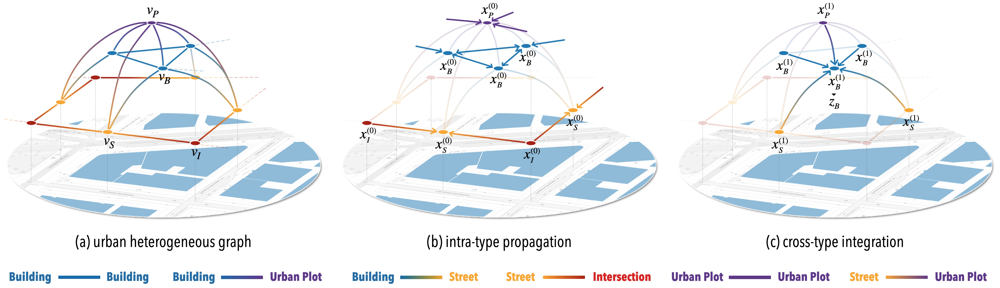
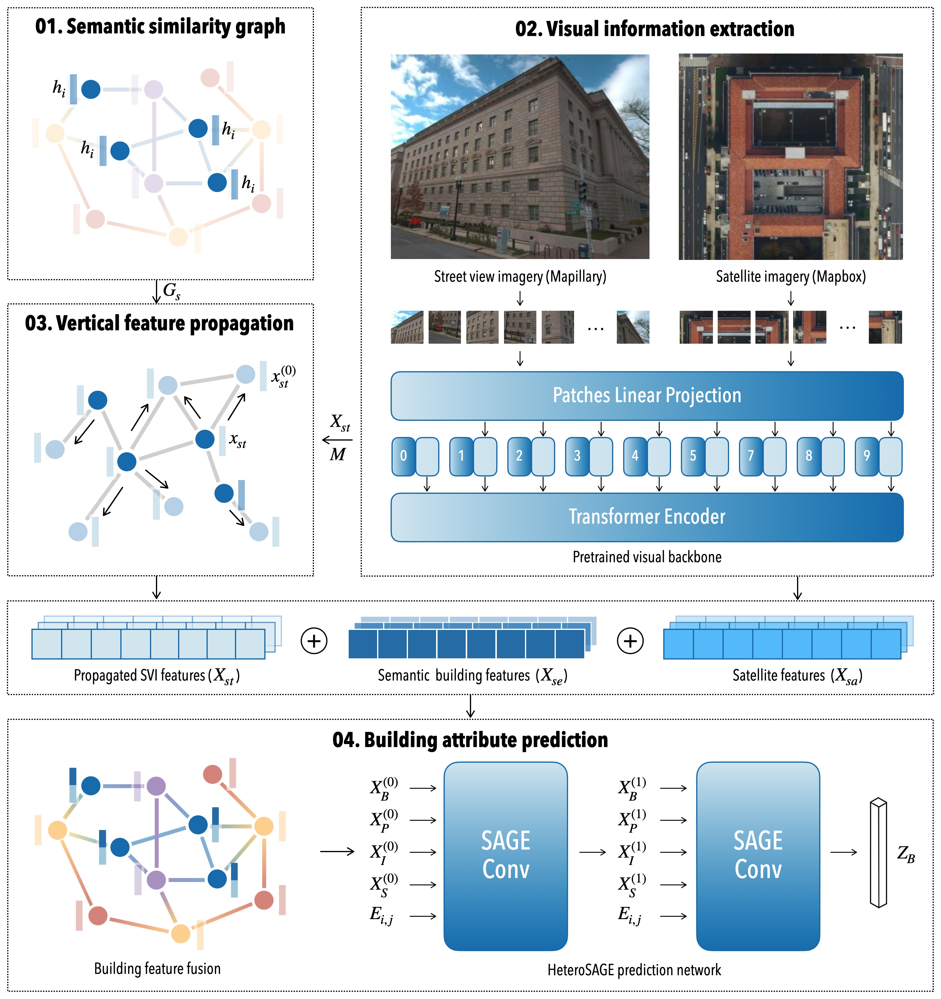

# HeteroGNN-building-attribute-prediction

Integrating hierarchical urban features and cross-view visual information for building attributes prediction.

## Project Description
This project introduces a framework that combines hierarchical urban features and cross-view visual information to predict building attributes. By leveraging a heterogeneous graph, the framework integrates multi-dimensional urban elements such as buildings, streets, intersections, and urban plots to represent geospatial features comprehensively. 

<em>Illustration of the heterogeneous GraphSAGE framework for building attribute prediction.</em>

It also incorporates high-resolution satellite and street-level imagery to enhance visual data, using feature propagation to address missing facade information. The fusion of morphological and visual features generates holistic representations for accurate building attribute prediction.

<em>Overview of the proposed framework integrating hierarchical urban features and cross-view visual information for building attribute prediction.</em>

## Package Requirements
To set up the environment and run the project, refer to the following repositories:

- **[Urbanity](https://github.com/winstonyym/urbanity)**: Follow the instructions in this repository to install the environment and run the relative programs in `code/`.
- **[OpenFACADES](https://github.com/seshing/OpenFACADES)**: Use this repository to request individual building images.

## Data
### 1. Download data
The process of downloading multi-modal data:

- **VHR**: `code/download_satellite_data.py`
- **SVI**: `code/download_svi_data.py`
- **Urban Graph**: `code/download_urban_graph.py`

### 2. Data examples
The testing data required for this project can be found in the following locations:

- `data/building_type`
- `data/urban_graph/Washington.zip`

Ensure these datasets are available and properly extracted before running the project.

## Acknowledgments
- Contributors: Xiucheng Liang, Winston Yap, and Filip Biljecki
- We acknowledge the contributors of OpenStreetMap, Mapillary and other platforms for providing valuable open data resources and code that support research and applications.
