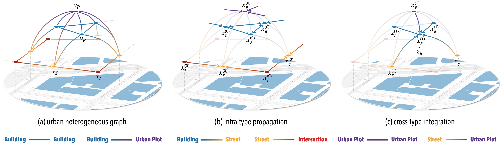
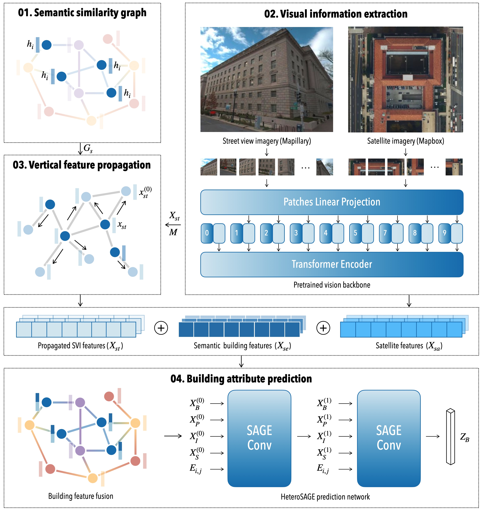

# HeteroGNN-building-attribute-prediction

Implementation and data for the paper: "**Heterogeneous graph neural networks for building attribute prediction from hierarchical urban features and cross-view imagery**" Published in the *ISPRS Journal of Photogrammetry and Remote Sensing*
[](https://doi.org/10.1016/j.isprsjprs.2026.02.016)

## Project Description
This project introduces a framework that combines hierarchical urban features and cross-view visual information to predict building attributes. By leveraging a heterogeneous graph, the framework integrates multi-dimensional urban elements such as buildings, streets, intersections, and urban plots to represent geospatial features comprehensively. 

<div align="center">

<p><em>Illustration of the heterogeneous GraphSAGE framework for building attribute prediction.</em></p>
</div>

It also incorporates high-resolution satellite and street-level imagery to enhance visual data, using feature propagation to address missing facade information. The fusion of morphological and visual features generates holistic representations for accurate building attribute prediction.

<div align="center">

<p><em>Overview of the proposed framework integrating hierarchical urban features and cross-view visual information for building attribute prediction.</em></p>
</div>

## Package Requirements
To set up the environment and run the project, refer to the following repositories:

- **[Urbanity](https://github.com/winstonyym/urbanity)**: Follow the instructions in this repository to install the environment and run the relative programs in `code/`.
- **[OpenFACADES](https://github.com/seshing/OpenFACADES)**: Use this repository to request individual building images.

## Data
### 1. Download data
The process of downloading multi-modal data:

- **VHR**: `code/download_satellite_data.py`
- **SVI**: `code/download_svi_data.py`
- **Urban Graph**: `code/download_urban_graph.py`

### 2. Data examples
The testing data required for this project can be found in the following locations:

- `data/building_type`
- `data/urban_graph/Washington.zip`

Ensure these datasets are available before running the project. For imagery, each image file should be named using the associated `building_id.png` format and placed in the corresponding directories：

- `data/svi` — street-view imagery
- `data/satellite` — satellite imagery

### 3. Inference result

The inference result in this study can be found at: [`output/results`](output/results)

## Citation
If you find our work helpful, please cite our paper.

```bibtex
@article{liang2026heterognn,
  title = {Heterogeneous Graph Neural Networks for Building Attribute Prediction from Hierarchical Urban Features and Cross-View Imagery},
  author = {Liang, Xiucheng and Yap, Winston and Biljecki, Filip},
  year = 2026,
  journal = {ISPRS Journal of Photogrammetry and Remote Sensing},
  volume = {234},
  pages = {185--204},
  issn = {0924-2716},
  doi = {10.1016/j.isprsjprs.2026.02.016},
}

```

## Acknowledgments
- Contributors: Xiucheng Liang, Winston Yap, and Filip Biljecki
- We acknowledge the contributors of OpenStreetMap, Mapillary and other platforms for providing valuable open data resources and code that support research and applications.
